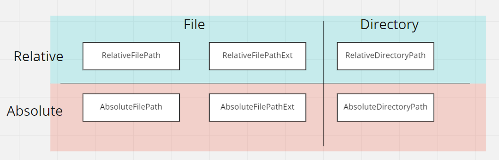

# Numani.TypedFilePath

ファイルパスの文字列を扱いやすくするためのライブラリです。

ファイルパスの持つ性質を以下のように型で表現します。



**Unityからも利用可能です。** 以下のgit urlをPackage Managerで指定してください。
```
https://github.com/NumAniCloud/Numani.TypedFilePath.git#upm-v0.1.0
```

## 機能

### TypedPath クラス

いくつかのファクトリーメソッドを持ちます。これにより、`string` 型で表現されたパスから、各種インターフェース型を実装するオブジェクトを生成できます。

また、カレントディレクトリのパスを取得する機能、パスを結合する機能があります。

### 各種インターフェース

以下のようなインターフェースがあります。

- `IFileSystemPath`
- `IFilePath`
- `IDirectoryPath`
- `IFilePathWithExtension`
- `IRelativePath`
- `IAbsolutePath`

これらを合成したインターフェースがあります。

- `IRelativeFilePath`
- `IRelativeFilePathExt`
- `IAbsoluteFilePath`
- `IAbsoluteFilePathExt`
- `IRelativeDirectoryPath`
- `IAbsoluteDirectoryPath`

ライブラリのユーザーはこれらインターフェース型にのみアクセスでき、具体的な型は内部に閉じ込められています。

## 基本的な使い方

`TypedPath.AsFilePath` メソッドなどを用いてオブジェクトを生成したら、本当に目的の型に解釈されたのかをパターンマッチングを使って確かめてから使います。

```csharp
// 使い方例

// 相対パスだと思っていたのに絶対パスだった場合などにはマッチしないパターンマッチング
if (TypedPath.AsFilePath(".\\Hoge\\Fuga.txt") is not IRelativeFilePathExt rfpe)
{
    // 想定通りに解釈されなかった場合は例外を投げたりできる
    throw new Exception();
}

// 想定通りに解釈されたならそれを使っていろいろする
return rfpe;
```

一度型つきファイルパスに変換したなら、その後は`型つきファイルパス → 型つきファイルパス`の変換メソッドが豊富に用意されているので、それほどパターンマッチングまみれにならずにコードを書けるかと思います。

### Combine

型つきファイルパスどうしを結合することができます。

```csharp
if (TypedPath.AsDirectoryPath(".\\Hoge\\Fuga") is not IRelativeDirectoryPath dir)
{
    throw new Exception();
}

if (TypedPath.AsFilePath("file.txt") is not IRelativeFilePath file)
{
    throw new Exception();
}

// "./Hoge/Fuga/file.txt" と表示される
Console.WriteLine(dir.Combine(file).PathString);
```

### WithExtension

ファイルパスに拡張子を付けたり外したりできます。

```csharp
if (TypedPath.AsFilePath("README") is not IRelativeFilePath file)
{
    throw new Exception();
}

var withExt = file.WithExtension(new FileExtension(".md"));

// "README.md" と表示される
Console.WriteLine(withExt.PathString);
```

```csharp
if (TypedPath.AsFilePath("README.md") is not IRelativeFilePathExt file)
{
    throw new Exception();
}

var without = file.WithoutExtension();

// "README" と表示される
Console.WriteLine(without.PathString);
```

### ファイル操作

型つきファイルパスから直接ファイルを操作することもできます。

```csharp
if (TypedPath.AsFilePath("README.md") is not IRelativeFilePath file)
{
    throw new Exception();
}

// ファイルが存在するかどうか確認
if (!file.Exists())
{
    // ファイルを作成する
    using var stream = file.OpenCreate();
}
```